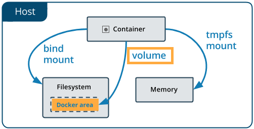
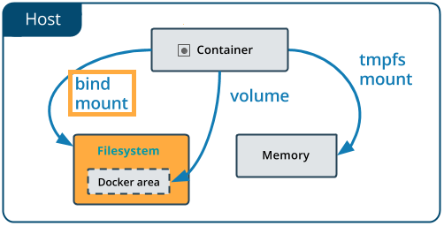
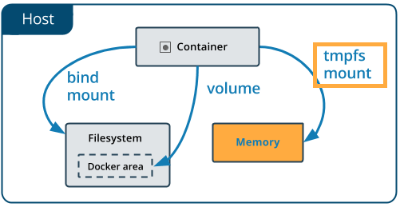

# Docker Volume

> **Parent command**

| Command       | Description    |
|---------------|----------------|
| docker volume | Manage Volumes |

> **Related Commands**

| Command               | Description                     |
|-----------------------|---------------------------------|
| docker volume create  | Create a Volume                 |
| docker volume inspect | Display detailed Information    |
| docker volume ls      | List Volumes                    |
| docker volume prune   | Remove all unused local volumes |
| docker volume rm      | Remove one or more volumes      |

**Docker Stroage Types**
Docker has three types of stroage. They are `Volume`, `Bind mount`, `tmpfs`. Volumes are completely managed by Docker. It is mostly used stroage type in Docker becouse of it's advantages.

> **Docker Volume Create**

> **Docker Volume Inspect**

> **Docker Volume List**

> **Docker Volume Prune**

> **Docker Volume Remove**